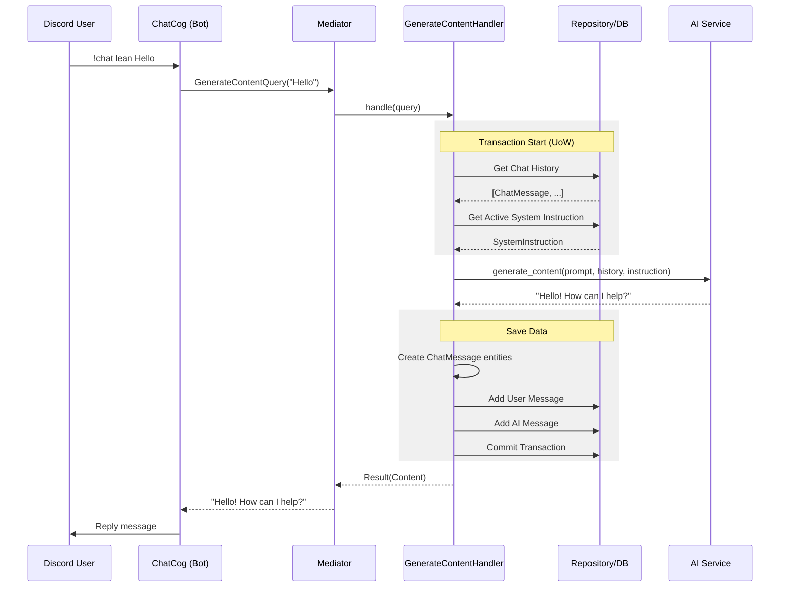

# アーキテクチャとデータフロー (Architecture & Data Flow)

本システムの主要な機能である「チャット応答」を例に、各レイヤー間のデータフローと相互作用を解説します。

## 全体像 (Overview)

システムは **Clean Architecture** に基づいており、データの流れは以下のようになります。

`Presentation (Bot)` -> `Application (UseCase)` -> `Domain` <-> `Infrastructure`

## 詳細データフロー: チャット応答 (Chat Response Flow)

ユーザーがDiscordでコマンド（例: `!chat lean こんにちは`）を実行してから、ボットが応答してDBに保存されるまでのステップは以下の通りです。

### 1. Presentation Layer (Bot)
- **File**: `app/bot/cogs/chat_cog.py`
- **Action**: Discordからのメッセージイベントを受信。
- **Process**:
    1. ユーザー入力 (`message`) を受け取る。
    2. アプリケーション層へのリクエストオブジェクト `GenerateContentQuery(prompt=message)` を作成。
    3. `Mediator.send_async(request)` を呼び出し、処理を委譲する。

### 2. Application Layer (UseCase)
- **File**: `app/usecases/chat/generate_content.py`
- **Component**: `GenerateContentHandler`
- **Process**:
    1. **履歴の取得**: `UnitOfWork` 経由で `ChatMessage` リポジトリから直近の会話履歴を取得。
    2. **システム指示の取得**: `UnitOfWork` 経由で `SystemInstruction` リポジトリから、現在アクティブな指示を取得。
    3. **AI生成 (Infrastructure)**: `IAIService` (Gemini/GPT) を呼び出し。入力として「プロンプト」「会話履歴」「システム指示」を渡す。
    4. **エンティティ生成 (Domain)**:
        - ユーザーの入力から `ChatMessage(Role.USER)` を生成。
        - AIの応答から `ChatMessage(Role.MODEL)` を生成。
    5. **保存 (Persistence)**: `UnitOfWork` を使用して両方のメッセージをリポジトリに追加し、`commit()` で確定。

### 3. Infrastructure Layer
- **Database**: `app/infrastructure/repositories/*.py` -> `SQLModel`
    - ドメインエンティティをDBモデル（ORM）に変換し、PostgreSQLに保存。
- **AI Service**: `app/infrastructure/services/gemini_service.py` など
    - 外部API (Google Gemini APIなど) と通信し、テキストを生成。

## アーキテクチャ図 (簡易版)

